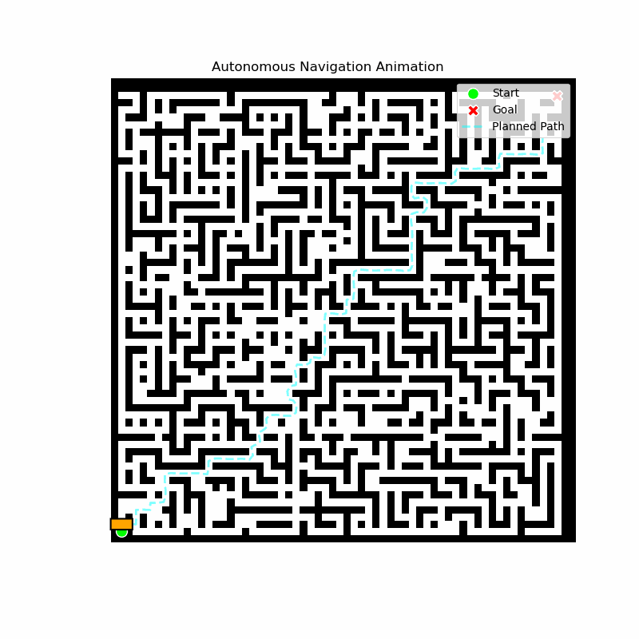
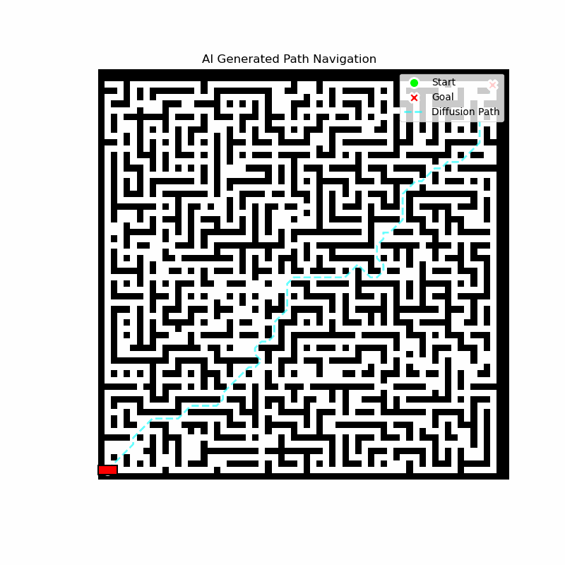
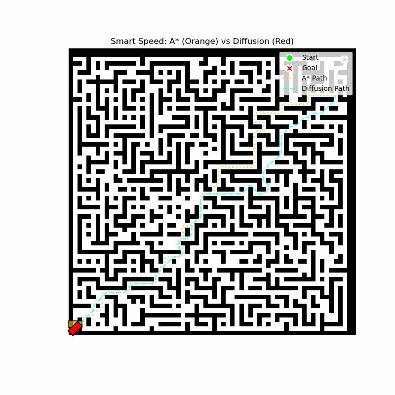
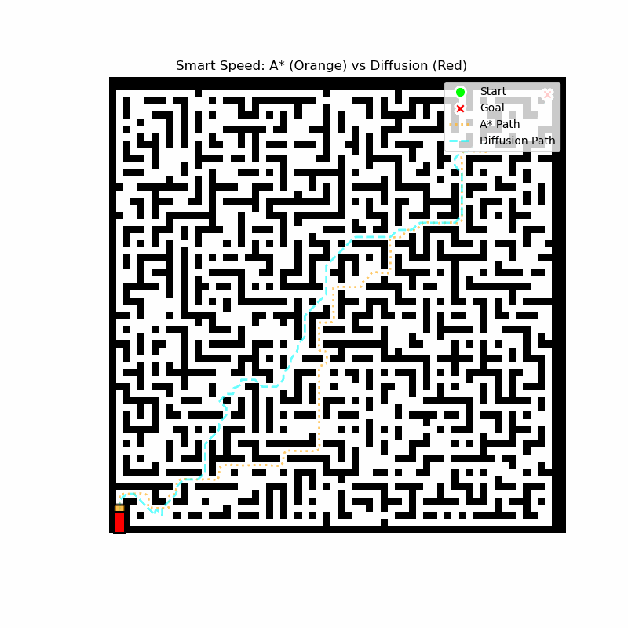
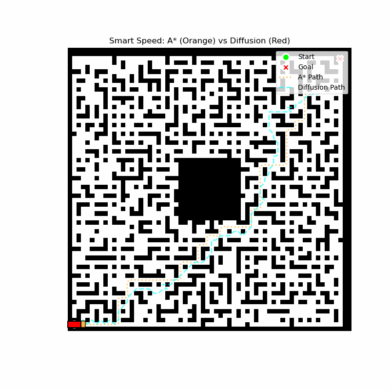

# Conditional Diffusion for Robot Path Planning

This project generates collision-free robot paths on 2D occupancy maps with a conditional denoising diffusion probabilistic model (DDPM). Given an occupancy grid plus start and goal locations, a U-Net is conditioned on `[occupancy, start_heatmap, goal_heatmap]` and denoises noise into a soft path probability mask. The mask is thresholded, skeletonized, and converted into a single start→goal trajectory. Classical A* with B-spline smoothing provides ground-truth path masks for training and a baseline for comparison. Training supports crash-safe checkpoint resume, and inference can draw multiple diffusion samples until a valid path is found.

## File Structure

```text
Conditional-Diffusion-Robot-Path-Planning/
├── main.ipynb              # Full pipeline: maps, train/resume, sample, demos, eval
├── requirements.txt
├── artifacts/
│   ├── ddpm_path_latest.pt           # resume / inference checkpoint
│   └── ddpm_path_model_<timestamp>.pt  # dated snapshots
├── a_str_demo.gif
├── red_car_Map0_diffusion.gif
├── comparison_astar_vs_diffusion_smart.gif
├── unseen_map_astar_vs_diffusion.gif
└── center_wall_astar_vs_diffusion.gif
```

## Requirements

```bash
python3 -m venv .venv
source .venv/bin/activate
pip install -r requirements.txt
```

Python 3.8+. Main packages: `torch`, `numpy`, `scipy`, `scikit-image`, `matplotlib`, `jupyter`.

## Getting started

1. Open the notebook:

```bash
jupyter notebook main.ipynb
```

(or open `main.ipynb` in VS Code / Cursor)

2. Run cells in order:

| Step | What it does |
|------|----------------|
| **0** | Generate maze maps; A* + B-spline ground-truth paths |
| **1–2** | Build dataset: condition maps → soft path-mask targets |
| **3** | Train or resume the conditional DDPM |
| **4–7** | Sample path mask(s) → threshold → skeletonize → extract path |
| **Demo** | Animate A* vs diffusion |
| **8** | Evaluate connectivity, collisions, path quality |

3. Useful notebook settings:

| Setting | Role |
|---------|------|
| `MAP_NUM` | Number of generated training maps |
| `n_epochs` | Training epochs |
| `CHECKPOINT_EVERY` | Save interval for crash-safe resume (default 50) |
| `N_SAMPLE_TRIALS` | Diffusion samples to try per map at inference |
| `TRAIN_FROM_SCRATCH` | Set `True` to ignore existing checkpoints |

If training is interrupted, re-run the setup cells and Step 3b. Training resumes from `artifacts/ddpm_path_latest.pt` when present; otherwise it falls back to the newest `artifacts/ddpm_path_model_*.pt` snapshot.

## Results

### A* demo (training map)



### Diffusion path on Map_0



### A* vs diffusion (training map)



### A* vs diffusion (unseen map)



### A* vs diffusion (center obstacle)


